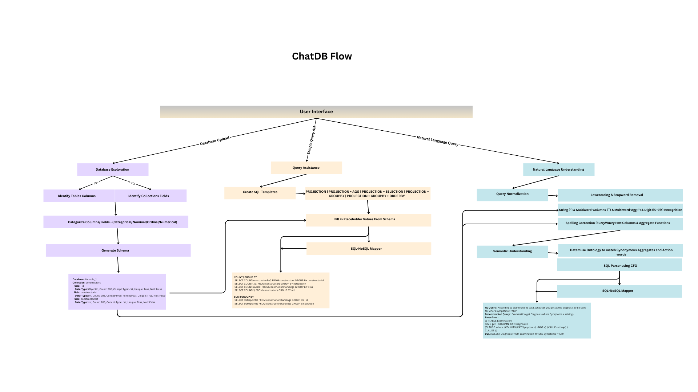
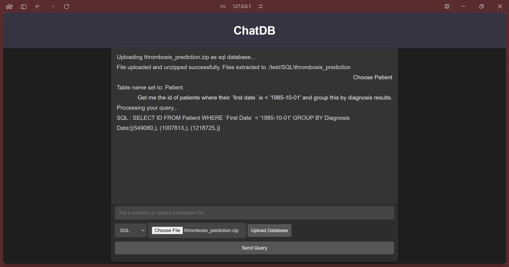

# ChatDB: Natural Language to Database Query Interface
Makes use of Non-Learning approaches for understanding natural language database queries


## Overview
ChatDB is an intelligent system designed to bridge the gap between natural language and database queries. It allows users to interact with databases using simple natural language commands, without requiring in-depth knowledge of SQL or NoSQL query syntax. This project focuses on enabling seamless access to both structured (SQL) and semi-structured (NoSQL) databases, making data retrieval more intuitive and user-friendly.

## Key Features
1. **Database Exploration:**
   - Supports **SQL** and **NoSQL** databases.
   - For **SQL**, accepts directories of `.sql` or `.csv` files where each file represents a table.
   - For **NoSQL**, expects a directory of **JSON** files, where each file is in JSON array format and named after the collection.
   - Uses **pymongo** for NoSQL (MongoDB) and **mysql-connector** for SQL (MySQL) databases.
   - Automatically identifies schema, data types, and conceptual types (e.g., categorical or numerical) for each table or collection.

2. **Query Generation:**
   - Generates query patterns based on identified data types and structures.
   - Supports common query operations like aggregation, filtering, and grouping.

3. **Natural Language Understanding:**
   - Uses **Context-Free Grammars (CFGs)** and **synonym lists** to interpret natural language commands.
   - Incorporates **word stemming**, **stop word removal**, and **fuzzy matching** to handle variations and deviations in user inputs.

4. **API Integration:**
   - APIs (using FastAPI) will be developed to enable the front-end chat interface to interact seamlessly with the backend components.

5. **BIRD Dataset:**
   - The project utilizes the **BIRD (Big Bench for Large-scale Database Grounded Text-to-SQL Evaluation)** dataset, which contains over 12,751 unique question-SQL pairs and 95 big databases across 37 professional domains.
   - Specifically, we are using a subsection of databases and tables from BIRD for our case study, including **Formula 1 races** data for NoSQL (MongoDB) and **thrombosis prediction** data for SQL (MySQL).

## Challenges
The primary challenge lies in handling the flexible structure of natural language, which can include synonyms, filler words, and unexpected phrasing. To address this, we use techniques like:
- **Word Stemming** and **Stop Word Removal** to simplify and clean the input.
- **Fuzzy Matching** to handle minor spelling errors or variations.
- **Synonym Identification** to map different wordings to the correct database actions or fields.

## Documentation Links
For more details, please refer to the following documents:
- [Initial Project Proposal](https://docs.google.com/document/d/1LIhxhNNjjJuYYTX6u0cONyoX1thEeESxuwI5pzT27No/edit?usp=sharing)
- [Mid-Progress Report](https://docs.google.com/document/d/1Yg6HRxdifWvS_QJRwJ7FEadRKbyaoDQ3uxtJpHb8Yg8/edit?usp=sharing)
- [Final Report](https://docs.google.com/document/d/1gKjGhpAoElTKi9B7CRJOXY8aMHNmCQPl4IewmJI1rFk/edit?usp=sharing)
- [BIRD Dataset](https://drive.google.com/file/d/1OwISGcBySjV1Hvhf3D8PWpt4r0-eRGVF/view?usp=sharing)

## Project File Descriptions

### `engine.py`
Contains all backend scripts required for:
- Database exploration
- Schema extraction
- Sample query generation
- Query normalization
- Query syntax and spelling correction
- Query parsing
- SQL-to-NoSQL mapping

---

### `hood.py`
API wrapper that serves endpoints for:
- Database upload
- Schema retrieval
- Query execution

---

### `static/`
Contains frontend files:
- **`index.html`**: User interface
- **`style.css`**: Styling for the interface

---

### `SQL/`
Directory containing the chosen SQL databases for testing and demonstration.

---

### `NoSQL/`
Directory containing the chosen NoSQL databases for testing and demonstration.

---

### `test_cases.py`
Includes sample SQL and NoSQL test queries for execution.

---

### `code.ipynb`
Jupyter notebook for interactive testing of the system's functionalities.

---

### `README.md`
Documentation of the project.

---

### `requirements.txt`
Lists Python dependencies required to run the project.

---

### `chat_db_flow.png`
Flowchart or diagram representing the system architecture.

---

### `sample_nosql_schema.txt`
Sample output for NoSQL schema description.

---

### `sample_nosql_querygen.txt`
Sample output for NoSQL query generation.


## Getting Started
To run the project locally, follow these steps:
1. **Prerequisites:**
   - Python 3.x
   - MySQL and MongoDB databases
   - Python packages: `pymongo`, `mysql-connector-python`, `fastapi`, `fuzzywuzzy`, etc.

2. **Installation:**
   ```bash
   git clone <repository-url>
   cd <repository-directory>
   pip install -r requirements.txt

3. **Setup:**
   ```bash
   fastapi run hood.py
   

Access the User Interface at the URL: [127.0.0.1:8000/static/index.html](http://127.0.0.1:8000/static/index.html)
4. ** Execution:**
The following steps need to be followed in order to completely utilize ChatDB's functionalities:
   - Select NoSQL or SQL from the dropdown menu according to the database you wish to upload
   - Upload a .zip (for NoSQL) or .sql/.csv/.sqlite (for SQL) file of the database
   - Enter a query that has the word "Explore" in order to perform data exploration
   - Typing a query that contains the word "Example", will result in ChatDB providing sample queries (SQL/NoSQL depending on chosen database type)
   - To choose a table in a database, execute the query "Choose (table name)"
   - After choosing the table, we can enter queries in natural language and get the respective SQL or NoSQL queries for it as well as the results of the query being executed on the data. Note: multi-word columns should be enclosed within back ticks "`"
Given below is an example of a query being executed:


